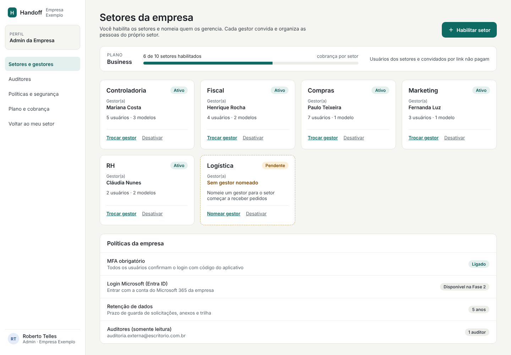
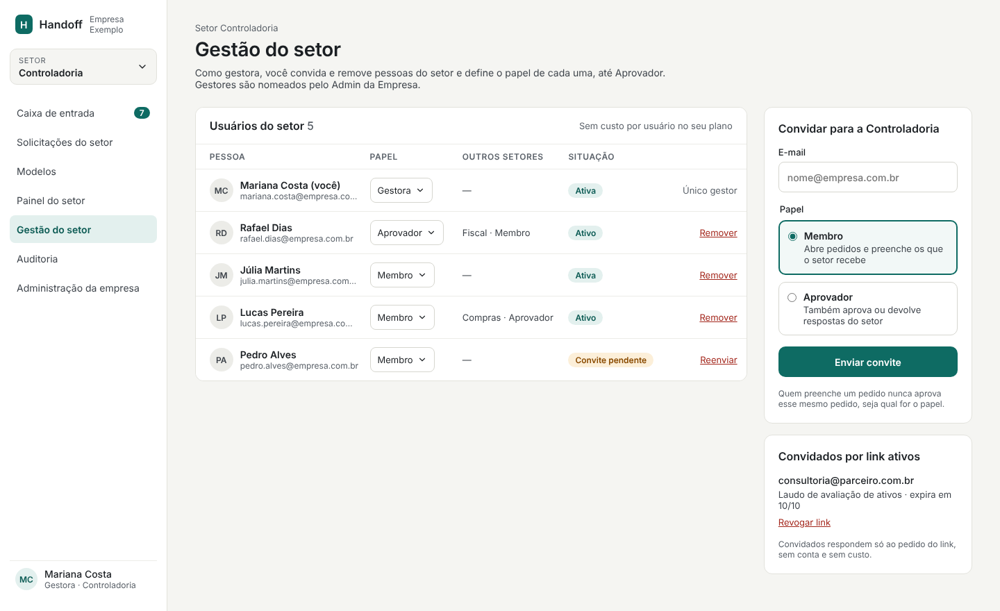
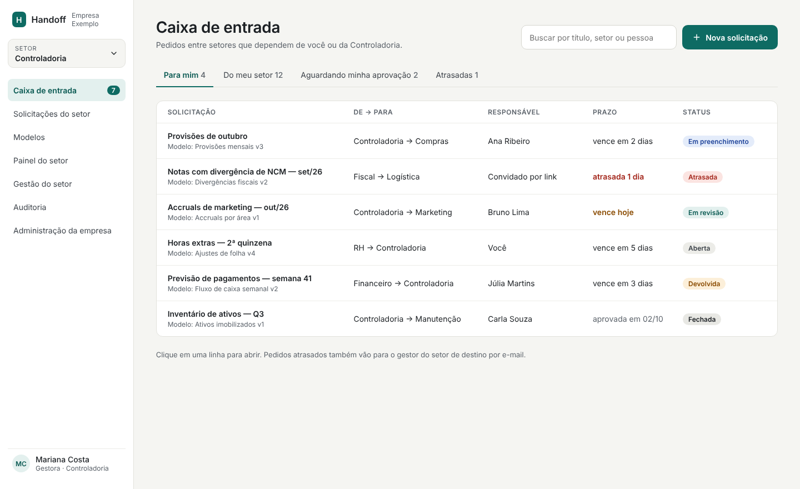
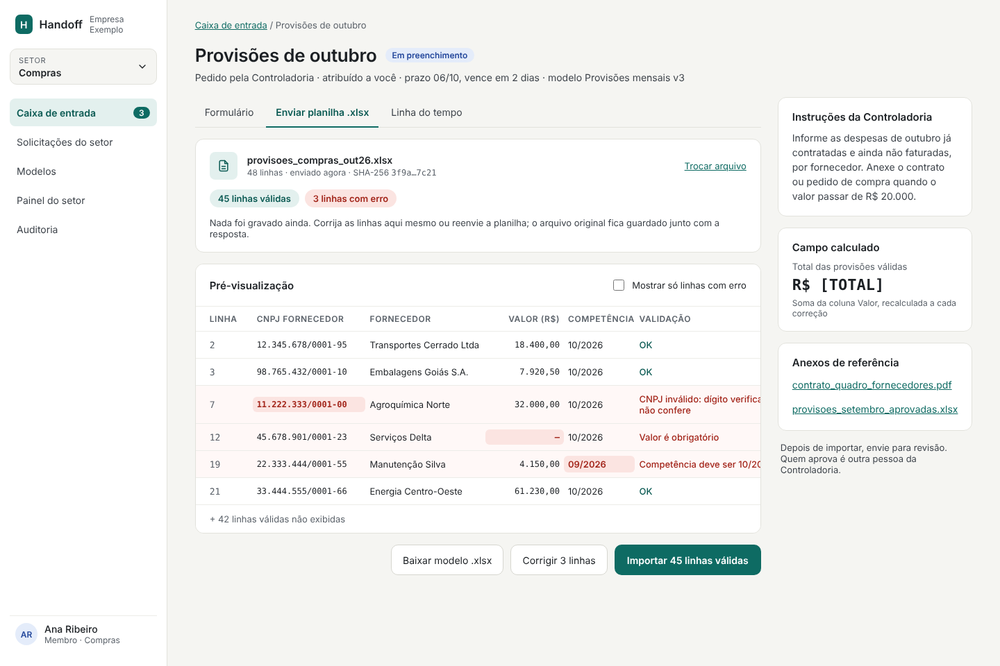
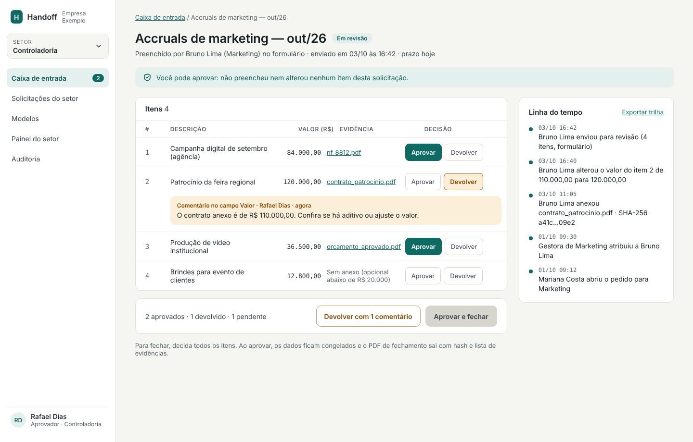

# Handoff

> Nome de trabalho, provisório.

SaaS multi-tenant que substitui o Excel na **troca de informações entre setores** de uma empresa. Um setor pede dados com um modelo estruturado e prazo, outro responde por formulário, por link sem login ou enviando o próprio .xlsx (validado linha a linha), e outra pessoa do setor que pediu aprova. O resultado fica congelado, com trilha de auditoria de quem mudou o quê, quando e com qual evidência.

**O Excel guarda o dado; o Handoff guarda o dado + o pedido + a resposta + a evidência + a aprovação.**

## Status

Fase de concepção: requisitos, análise crítica e mockup das telas. Ainda não há código da aplicação. O próximo passo é validar a dor com 5–10 controllers ou gerentes fiscais e escolher o fluxo piloto.

## Documentos

| Documento | Conteúdo |
| --- | --- |
| [Requisitos técnicos](docs/requisitos-tecnicos.md) | Escopo do MVP, perfis e permissões, 29 requisitos funcionais por fase, frontend, arquitetura multi-tenant (Postgres + RLS), backend, requisitos não funcionais, deploy em OCI/OKE, roadmap e critérios de aceite |
| [Análise crítica do MVP](docs/analise-critica-mvp.md) | Pesquisa de mercado e concorrência (Microsoft 365, Pipefy, Zeev, Smartsheet, FloQast), pontos fracos da primeira versão, riscos e perguntas de validação |
| [MVP revisado](docs/mvp-revisado.md) | As 16 dores mapeadas para soluções, modelo de perfis por setor, fluxo da solicitação e escopo por fase |

## Como funciona o acesso

A administração é delegada em dois níveis:

- **Admin da Empresa** habilita os setores (Fiscal, Compras, Controladoria…) e nomeia o gestor de cada um.
- **Gestor do Setor** convida e remove as pessoas do próprio setor e define o papel de cada uma (Membro ou Aprovador).
- **Convidado por link** responde a um pedido específico sem criar conta.
- **Auditor** lê tudo, sem editar.

Quem preenche um pedido nunca aprova esse mesmo pedido; a regra é aplicada no backend.

## Mockup das telas

O protótipo está em [`mock/`](mock/). Para abrir no navegador, sirva a pasta e acesse `mock/index.html`:

```bash
npx serve mock     # ou: python3 -m http.server -d mock
```

Os arquivos `.dc.html` são a fonte editável do canvas de design; o `mock/support.js` é um renderizador mínimo para abri-los fora do editor.

| Tela | Captura |
| --- | --- |
| 1. Admin da empresa — setores e gestores |  |
| 2. Gestor do setor — usuários e papéis |  |
| 3. Caixa de entrada |  |
| 4. Responder — upload .xlsx validado |  |
| 5. Revisão por outra pessoa |  |
| 6. Convidado por link (celular) |  |

Nomes, empresa e valores das telas são exemplos.

## Stack prevista

Node.js 22 + TypeScript + Fastify · PostgreSQL 16 com Row-Level Security · BullMQ/Redis · React + Vite + shadcn/ui · OCI (OKE, Object Storage, Vault) · Loki/Prometheus/OpenTelemetry. Detalhes em [Requisitos técnicos](docs/requisitos-tecnicos.md).

## Estrutura

```
.
├── README.md
├── docs/
│   ├── requisitos-tecnicos.md
│   ├── analise-critica-mvp.md
│   ├── mvp-revisado.md
│   └── telas/            capturas das telas (PNG)
└── mock/
    ├── index.html        índice das telas
    ├── support.js        renderizador mínimo dos .dc.html
    ├── canvas.json       disposição das telas no canvas de design
    └── *.dc.html         uma tela por arquivo
```
