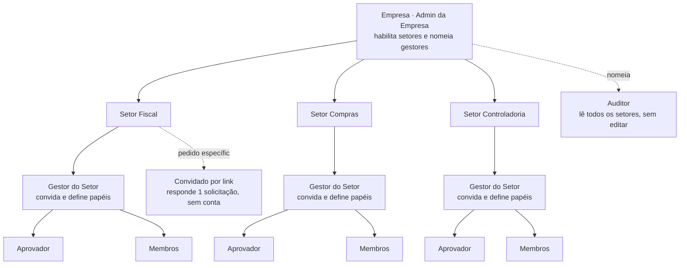
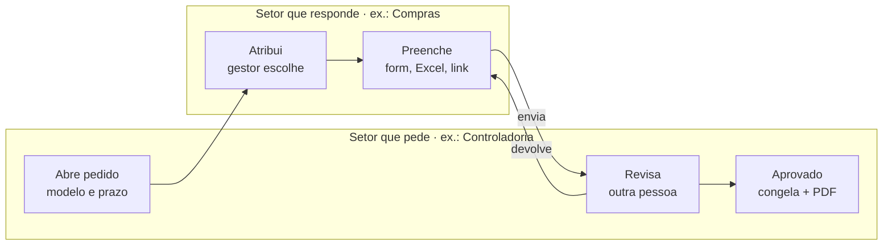

# MVP revisado

04/10/2026 · responde aos pontos da [Análise crítica](analise-critica-mvp.md); as mudanças já estão aplicadas em [Requisitos técnicos](requisitos-tecnicos.md)

## Resumo

O MVP revisado é **um balcão de solicitações entre setores**. A empresa habilita os setores, e cada setor tem um gestor que adiciona os próprios usuários. Os setores pedem dados uns aos outros com prazo; quem responde pode usar formulário, link sem login ou o próprio Excel validado. Quem pediu aprova, e o resultado fica congelado com trilha de auditoria.

Todas as 16 dores levantadas na análise crítica e na proposta original têm uma resposta no produto (próxima seção). Sendo honesto sobre o "100%", duas coisas o software não garante sozinho: que as pessoas abandonem o e-mail e que alguém aprove a compra. A última seção trata disso.

## Dores mapeadas

São 16 dores: 7 vêm do uso do Excel por e-mail e 9 vêm da análise crítica da primeira versão do MVP. Para cada uma, a tabela mostra a resposta do produto.

| # | Dor | Como o MVP resolve |
| --- | --- | --- |
| 1 | Várias versões do mesmo arquivo circulando | Cada solicitação tem um único registro vivo; não existe "versão final_v3" |
| 2 | Pedido por e-mail sem prazo nem dono | Solicitação com setor de destino, responsável, prazo e lembretes automáticos em 48h, no dia e no atraso |
| 3 | Erro de digitação e de formato | Validação por campo (CNPJ, data, moeda, lista) no formulário e linha a linha no upload do .xlsx, antes de gravar |
| 4 | Ninguém sabe quem alterou o quê | Trilha append-only por campo: quem, quando, antes, depois e origem (tela, upload ou link) |
| 5 | Evidência solta no e-mail | Anexo preso ao item, com hash SHA-256 e o .xlsx original guardado intacto |
| 6 | Quem preenche também aprova | Bloqueio no backend: o aprovador tem que ser outra pessoa |
| 7 | Sem visão de atrasos entre áreas | Painel por setor com o que está no prazo, atrasado e devolvido |
| 8 | Preenchedor não quer mais uma ferramenta nem login | Link com código por e-mail para responder sem conta; quem preenche sempre também pode subir o Excel que já tem |
| 9 | O dado vem do ERP e é copiado à mão | Importação do relatório exportado do ERP com mapeamento de colunas salvo por modelo; a IA sugere o mapeamento na primeira vez |
| 10 | "O TI monta isso no Power Automate de graça" | Pronto para usar com modelos por setor, login Microsoft (Entra ID) e avisos no Outlook e no Teams: entra como parte do 365, sem montar fluxo |
| 11 | Comprador indefinido | O setor vira dono: a empresa habilita setores e cada setor tem gestor, modelos e indicadores próprios |
| 12 | Cálculos simples continuam no Excel | Campos calculados no modelo (soma, subtração, multiplicação, percentual, total da coluna), sem fórmulas livres |
| 13 | Montar modelo é trabalhoso | Biblioteca de modelos prontos + "criar modelo a partir de uma planilha": envia um .xlsx e o sistema propõe os campos |
| 14 | Preço por usuário trava a adoção | Cobrança por setor habilitado; usuários dentro do setor e preenchedores por link não pagam |
| 15 | Auditoria pede prova do que foi aprovado | Aprovação congela os dados e gera PDF com hash, aprovadores e lista de evidências |
| 16 | Escopo grande demais para validar | Entrega em 3 fases, com a Fase 1 em 6 semanas focada em um fluxo piloto |

## Modelo de perfis

A administração é delegada em dois níveis: o Admin da Empresa liga e desliga setores, e o Gestor de cada setor coloca e tira os próprios usuários, sem depender do TI nem do Admin para o dia a dia.

Setores de exemplo. O convidado por link e o auditor ficam fora dos setores: o primeiro recebe uma solicitação específica de um setor, o segundo é nomeado pelo Admin e só lê.

## Permissões por perfil

São seis perfis. O Admin da Empresa decide **quais setores existem e quem os gerencia**. O Gestor do Setor decide **quem entra no setor e com qual papel**. Ninguém concede um papel acima do próprio.

| Ação | Admin da Empresa | Gestor do Setor | Aprovador | Membro | Convidado por link | Auditor |
| --- | --- | --- | --- | --- | --- | --- |
| Habilitar ou desativar setor | Sim | Não | Não | Não | Não | Não |
| Nomear ou trocar o Gestor do Setor | Sim | Não | Não | Não | Não | Não |
| Convidar e remover usuários do setor | Sim | Sim, só no próprio setor | Não | Não | Não | Não |
| Definir papel do usuário no setor | Sim | Sim, até Aprovador | Não | Não | Não | Não |
| Criar e publicar modelos do setor | Não | Sim | Não | Não | Não | Não |
| Abrir solicitação para outro setor | Não | Sim | Sim | Sim | Não | Não |
| Preencher solicitação recebida | Não | Sim | Sim | Sim | Sim, só a que recebeu | Não |
| Aprovar ou devolver resposta | Não | Sim | Sim | Não | Não | Não |
| Ver solicitações do setor | Painel geral | Todas do setor | Todas do setor | As que abriu ou recebeu | Só a do link | Todas, só leitura |
| Exportar trilha de auditoria | Sim | Do próprio setor | Não | Não | Não | Sim |
| Políticas da empresa (MFA, SSO, retenção) | Sim | Não | Não | Não | Não | Não |

**Regras de delegação**

- Um usuário pode estar em vários setores com papéis diferentes (por exemplo, Aprovador no Fiscal e Membro em Compras).
- Um setor precisa de pelo menos um Gestor ativo; o último gestor não consegue se remover.
- Usuário removido perde o acesso na hora, mas tudo o que ele fez continua na trilha com o nome dele.
- O Admin da Empresa não preenche nem aprova por padrão; se precisar, entra no setor como membro, e isso fica registrado.
- O Gestor pode limitar, por modelo, quais papéis veem campos sensíveis (por exemplo, salário só para Aprovador do RH).
- Toda mudança de setor, papel ou convite gera evento de auditoria.
- Convidado por link responde uma solicitação específica, com código de 6 dígitos enviado ao e-mail indicado; o link expira no prazo da solicitação.

## Como uma solicitação circula entre setores

O pedido nasce em um setor, vai para o gestor do outro, que escolhe quem responde, e volta para revisão de outra pessoa do setor que pediu.

A devolução pode acontecer quantas vezes for preciso, sempre com comentário preso ao item; cada passagem de mão fica na trilha de auditoria. O convidado por link entra no passo Preenche quando o setor repassa a solicitação.

## Parecido com o Excel, mas não igual

O produto aproveita o que as pessoas já sabem fazer no Excel. A liberdade total fica de fora, porque é justamente ela que gera erro e falta de controle.

| Aspecto | No Excel | No MVP |
| --- | --- | --- |
| Colunas e campos | Livres, cada um cria as suas | Definidas no modelo pelo setor que pede, com tipo e validação |
| Entrada de dados | Digitar ou colar em qualquer célula | Formulário, link ou upload do próprio .xlsx, sempre validado |
| Fórmulas | Qualquer fórmula, macro e referência | Só campos calculados simples definidos no modelo |
| Envio | Anexo por e-mail | Solicitação com prazo, responsável e status |
| Versões | Cópias soltas | Um registro, com histórico de cada alteração |
| Aprovação | "Ok" no e-mail | Aprovação registrada, feita por outra pessoa |
| Saída | O próprio arquivo | Exportar para .xlsx a qualquer momento + PDF de fechamento |
| Gráficos, tabelas dinâmicas, análise | Sim | Não; o usuário exporta e analisa no Excel |

## Escopo por fase

A Fase 1 já resolve 9 das 16 dores e roda em 6 semanas. A Fase 2 só começa depois que 2 ou 3 empresas piloto usarem a Fase 1 em um fluxo real.

| Fase | Semanas | Entregas | Dores resolvidas |
| --- | --- | --- | --- |
| 1 · Piloto | 1–6 | Empresa e setores, gestor convida usuários, papéis por setor, modelos prontos para o fluxo piloto, solicitação com prazo, formulário, upload .xlsx validado, link sem login, aprovação por outra pessoa, trilha append-only, congelamento + PDF, lembretes por e-mail | 1, 2, 3, 4, 5, 6, 8, 11, 15 |
| 2 · Adoção | 7–10 | Login Microsoft e avisos no Outlook e no Teams, painel por setor, campos calculados, mapeamento de importação do ERP com sugestão por IA, criar modelo a partir de planilha, biblioteca de modelos | 7, 9, 10, 12, 13 |
| 3 · Venda | 11–14 | Cobrança por setor habilitado, cadastro de empresa assistido, exportação completa do tenant, revisão de LGPD, cadeia de hash se um cliente pedir | 14 |

A dor 16 (escopo grande) é resolvida pela própria divisão em fases.

## O que o software não resolve sozinho

O produto cobre as 16 dores, mas três riscos dependem de validação e de venda, não de código:

- **Hábito do e-mail.** O link sem login e o upload do Excel reduzem o atrito, mas só o piloto mostra se as pessoas largam o anexo. Meta da Fase 1: pelo menos 80% das respostas do fluxo piloto passando pelo sistema após 4 semanas.
- **Decisão de compra.** O modelo por setor dá um dono, mas alguém ainda precisa aprovar o orçamento. Isso se valida nas entrevistas ([Análise crítica](analise-critica-mvp.md)), perguntando quem paga.
- **Integração nativa com ERP.** O MVP importa o que o ERP exporta, mas ainda não conecta direto via API. Conectores nativos (TOTVS, SAP, Senior) só entram quando um cliente piloto justificar.
