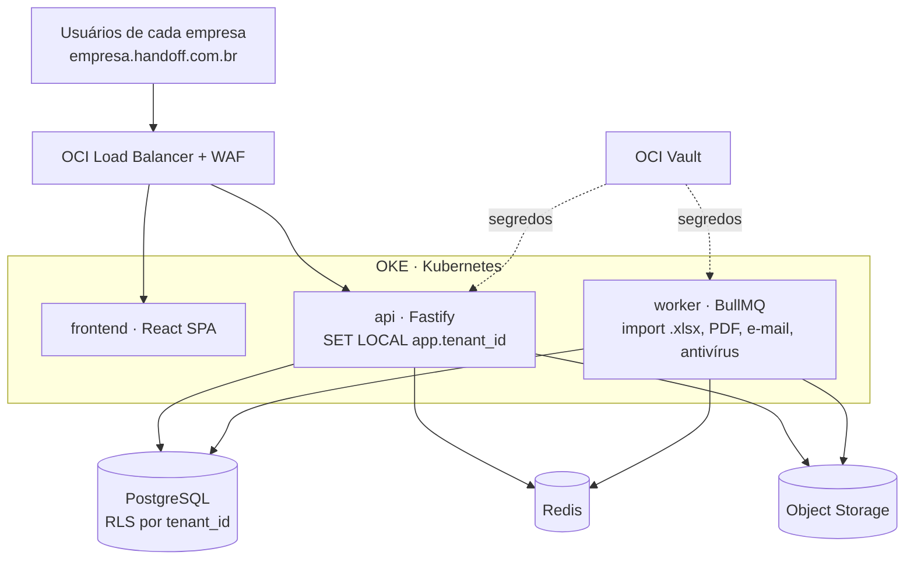

# Requisitos Técnicos — Plataforma de Solicitações entre Áreas (SaaS)

Atualizado em 04/10/2026 · Jp

## Visão geral e escopo do MVP

O MVP substitui o Excel no **handoff entre setores**: a empresa habilita os setores, cada setor tem um gestor que adiciona os próprios usuários, um setor pede dados com um modelo estruturado e outro responde (formulário, link sem login ou upload .xlsx validado). Quem pediu aprova, e o resultado fica congelado com trilha de auditoria. Nome de trabalho: **Handoff** (provisório). Este documento já incorpora a revisão feita em [MVP revisado](mvp-revisado.md).

**Problema.** Hoje o pedido vai por e-mail com anexo, cada área devolve uma versão diferente, não há prazo controlado, nem histórico de quem alterou o quê, nem prova do que sustentou cada número.

**Proposta de valor em uma frase:** o Excel guarda o dado; o Handoff guarda o dado + o pedido + a resposta + a evidência + a aprovação.

**Dentro do MVP**

- Empresa (tenant) com setores habilitados pelo Admin; cada setor com gestor que convida e define papéis dos próprios usuários
- Modelos prontos para o fluxo piloto e criação de modelo a partir de uma planilha
- Solicitações entre setores com prazo, responsável e status
- Resposta por formulário, por link sem conta ou por upload .xlsx validado linha a linha
- Revisão por outra pessoa: aprovar ou devolver com comentário por item
- Fechamento congelado, trilha de auditoria append-only e PDF de fechamento
- Lembretes por e-mail; login Microsoft e avisos no Outlook e no Teams na Fase 2
- Exportação para Excel a qualquer momento

**Fora do MVP** (fases seguintes): fórmulas livres e macros, grade estilo planilha, construtor visual completo de modelos, cadeia de hash (opcional, Fase 3), conectores nativos com ERP, solicitações recorrentes automáticas, app mobile nativo, assinatura ICP-Brasil, BI embutido.

## Setores que podem usar

Qualquer setor que hoje pede ou devolve planilha por e-mail pode ser habilitado na mesma empresa, mas o MVP começa com **um fluxo piloto** (Controladoria no fechamento mensal ou Fiscal nas divergências), escolhido nas entrevistas. Os demais setores abaixo entram como modelos prontos a partir da Fase 2.

| Setor que pede | Setor que fornece | Exemplo de solicitação | Por que a auditoria importa |
| --- | --- | --- | --- |
| Fiscal / Tributário | Compras, Logística | Notas com divergência de CFOP/NCM no mês | Autuação fiscal, Reforma Tributária (CBS/IBS) |
| Controladoria / Contabilidade | Todas as áreas | Provisões e accruals para o fechamento mensal | Auditoria externa, fechamento contábil |
| Financeiro / Tesouraria | Comercial, Compras | Previsão de pagamentos e recebimentos da semana | Fluxo de caixa, aprovação de pagamentos |
| RH / DP | Gestores de cada área | Horas extras, ajustes de folha, desligamentos | eSocial, passivo trabalhista |
| Qualidade / SSMA | Produção, Manutenção | Não conformidades e planos de ação | ISO 9001/14001, ONA em hospitais |
| Compras / Suprimentos | Áreas requisitantes | Levantamento de demanda e cotações | Compliance de compras, alçadas |

Segmentos-alvo iniciais: médias empresas (100–2.000 funcionários) em agronegócio, saúde, varejo e indústria, onde o ERP não cobre o fluxo informal entre áreas.

## Perfis, papéis e permissões

O acesso é delegado em dois níveis: o **Admin da Empresa habilita os setores e nomeia os gestores**, e o **Gestor de cada setor convida e remove os próprios usuários** e define o papel de cada um. A segregação é fixa: **quem preenche não aprova a mesma solicitação**, validado no backend. O diagrama da hierarquia está em [MVP revisado](mvp-revisado.md).

| Perfil | Escopo | Pode | Não pode |
| --- | --- | --- | --- |
| Super Admin (plataforma) | Todas as empresas | Criar e suspender empresas, suporte com acesso auditado | Ver dados de negócio sem ticket registrado |
| Admin da Empresa | Uma empresa | Habilitar e desativar setores, nomear gestores, políticas (MFA, SSO, retenção), painel geral, exportar auditoria | Preencher ou aprovar sem entrar no setor; alterar eventos de auditoria |
| Gestor do Setor | O próprio setor | Convidar e remover usuários do setor, definir papéis até Aprovador, criar modelos, abrir, atribuir e aprovar solicitações | Gerenciar outro setor; aprovar o que ele mesmo preencheu |
| Aprovador | O próprio setor | Abrir e preencher solicitações, aprovar ou devolver respostas | Convidar usuários; aprovar o que preencheu |
| Membro | O próprio setor | Abrir solicitações, preencher as recebidas, anexar, comentar | Aprovar |
| Convidado por link | Uma solicitação | Preencher e anexar naquela solicitação, com código por e-mail | Qualquer outra tela |
| Auditor | Empresa toda, só leitura | Ler tudo, trilha completa, exportar evidências | Qualquer escrita |

Regras de delegação:

- Um usuário pode estar em vários setores com papéis diferentes (por exemplo, Aprovador no Fiscal e Membro em Compras).
- Todo setor tem pelo menos um Gestor ativo; o último gestor não consegue se remover.
- Ninguém concede papel acima do próprio; só o Admin nomeia gestores.
- Usuário removido perde o acesso na hora, mas o que fez continua na trilha com o nome dele.
- Permissão por campo no modelo: campos podem ficar ocultos ou só leitura por papel (por exemplo, salário só para Aprovador do RH).
- Alçada opcional por valor: acima de X, exige segundo aprovador.
- Toda mudança de setor, papel, convite ou link gera evento de auditoria.

## Regras operacionais do fluxo

Estas regras fecham as ambiguidades que normalmente aparecem quando um fluxo entre áreas sai do e-mail e vira sistema. Elas são regras de negócio, não detalhes de implementação.

| ID | Regra operacional |
| --- | --- |
| RN-OP-01 | **Dono da solicitação:** o setor de origem é dono do pedido; o setor de destino é dono da resposta. O responsável individual executa a tarefa, mas o SLA pertence ao setor, não à pessoa. |
| RN-OP-02 | **Prazo e atribuição:** o prazo começa quando a solicitação é aberta para o setor de destino, mesmo que o gestor ainda não tenha atribuído um responsável. O painel separa atraso de atribuição do atraso de execução. |
| RN-OP-03 | **Reatribuição:** Gestor do Setor pode trocar o responsável enquanto a solicitação estiver aberta, em preenchimento, em correção ou aguardando submissão. A troca nunca reinicia o SLA, nunca apaga rascunho, comentários ou evidências e sempre registra responsável anterior, novo responsável, autor da troca, data/hora e motivo. O responsável anterior perde imediatamente a permissão de edição e submissão, mas continua identificado em tudo o que produziu. |
| RN-OP-04 | **Substituição de gestor:** um setor pode ter mais de um Gestor. Não se pode deixar um setor ativo sem Gestor; ausência, férias ou desligamento não podem bloquear solicitações. |
| RN-OP-05 | **Devolução não reinicia o histórico:** ao devolver, o revisor informa motivo obrigatório por item/campo. O prazo original continua registrado e o revisor define um novo prazo de correção; ambos aparecem no SLA. |
| RN-OP-06 | **Aprovação por item:** cada item pode ficar Pendente, Enviado, Aprovado ou Devolvido. A solicitação só fica Aprovada quando todos os itens obrigatórios estiverem aprovados. Itens já aprovados ficam bloqueados para edição enquanto os devolvidos são corrigidos. |
| RN-OP-07 | **Maker-checker por pessoa, não por papel:** quem submeteu qualquer item não pode aprovar aquele mesmo item, mesmo que participe de outro setor ou tenha papel de Aprovador em outro contexto. |
| RN-OP-08 | **Cancelamento:** somente o setor de origem (autor, Gestor ou Aprovador autorizado) pode cancelar uma solicitação não fechada; motivo é obrigatório. Cancelamento não apaga dados, anexos nem histórico. |
| RN-OP-09 | **Retificação após fechamento:** solicitação fechada nunca é reaberta nem alterada. Correção posterior cria uma Retificação vinculada ao fechamento anterior, com novo ciclo de resposta/aprovação e preservação de todas as versões. |
| RN-OP-10 | **Versão do modelo:** a solicitação fica presa à versão do modelo vigente no momento da abertura. Publicar uma versão nova nunca altera solicitações já abertas ou fechadas. |
| RN-OP-11 | **Desativação, não exclusão:** usuário, setor, modelo e empresa com histórico operacional não são apagados pelo fluxo normal; são inativados. Setor com solicitações abertas só pode ser desativado após transferência ou encerramento das pendências. |
| RN-OP-12 | **Evidência após envio:** adicionar, substituir ou remover evidência depois do envio devolve o item para revisão. Evidência usada em fechamento anterior permanece preservada. |
| RN-OP-13 | **Competência:** modelos podem exigir uma chave de competência (mês, semana, folha, período fiscal etc.). A combinação modelo + setor destino + competência pode ser marcada como única para evitar duplicidade acidental. |
| RN-OP-14 | **Coleta/campanha:** quando o mesmo pedido precisa ir para vários setores, o usuário cria uma coleta que gera solicitações-filhas independentes por setor. Cada filha tem responsável, SLA e aprovação próprios; a coleta mostra visão consolidada. |
| RN-OP-15 | **Recorrência:** fluxos recorrentes geram uma nova solicitação/coleta por competência; nunca reciclam a solicitação do período anterior. A recorrência pode ser pausada sem apagar ocorrências já criadas. |
| RN-OP-16 | **Convidado:** convidado interno sem conta e terceiro externo são tratados como participantes de uma solicitação específica, nunca como membros do setor. A empresa pode proibir convidados externos por política. |
| RN-OP-17 | **Expiração e escalonamento:** nenhuma aprovação pode ficar aguardando indefinidamente. Solicitações vencidas continuam visíveis e editáveis conforme permissão, mas entram em atraso e disparam escalonamento ao Gestor; o prazo não some nem é renovado automaticamente. |
| RN-OP-18 | **Responsabilidade registrada:** o fechamento distingue quem forneceu a informação, quem alterou, quem submeteu e quem aprovou. Aprovação confirma a revisão do conteúdo aprovado; não transfere a autoria do dado para o aprovador. |

### Reatribuição de responsável — regra detalhada

A reatribuição existe para impedir que férias, ausência, desligamento, mudança de função ou erro de atribuição deixem a solicitação parada. Ela **transfere a responsabilidade operacional daqui para frente**, mas não reescreve o passado.

**Quem pode reatribuir**
- Gestor do setor de destino pode trocar o responsável enquanto houver trabalho pendente no setor.
- Admin da Empresa só pode intervir em contingência, quando não existir Gestor ativo no setor; a intervenção fica destacada na auditoria.
- O próprio responsável pode solicitar a troca, mas não efetivá-la sozinho.

**O que é preservado**
- prazo original e eventuais prazos de correção;
- rascunho já preenchido;
- arquivos e evidências anexados;
- comentários;
- validações já executadas;
- itens já aprovados ou devolvidos;
- autoria de cada alteração anterior.

**O que muda imediatamente**
- o novo responsável recebe permissão de editar os itens ainda editáveis e de submeter a resposta;
- o responsável anterior perde permissão de editar/submeter, salvo se continuar autorizado por outro papel independente;
- o novo responsável recebe notificação com contexto, prazo atual e pendências;
- a caixa de entrada do gestor e do novo responsável é atualizada sem gerar uma nova solicitação.

**SLA e indicadores**
- reatribuir **não reinicia nem estende automaticamente o prazo**;
- o sistema registra separadamente tempo sem responsável, tempo com cada responsável e tempo total do setor;
- se a troca ocorrer depois do vencimento, a solicitação continua atrasada;
- qualquer extensão de prazo é uma ação própria, separada da reatribuição, com motivo e auditoria.

**Motivo obrigatório**
Toda reatribuição exige um motivo padronizado, com comentário opcional: Férias/Ausência, Desligamento, Mudança de função, Carga de trabalho, Atribuição incorreta, Escalonamento ou Outro.

**Casos especiais**
- Se o responsável for desativado ou removido do setor com solicitações pendentes, essas solicitações entram em **Aguardando reatribuição** e o Gestor é notificado; elas não são automaticamente transferidas para uma pessoa arbitrária.
- Se houver vários itens e somente parte deles tiver sido produzida pelo responsável anterior, a autoria permanece por item/campo.
- Reatribuição durante revisão não troca o aprovador automaticamente; responsável pelo preenchimento e responsável pela aprovação são funções independentes.
- Reatribuição não permite burlar maker-checker: quem preencheu um item anteriormente continua impedido de aprovar aquele mesmo item mesmo após deixar de ser o responsável atual.

**Exemplo**

~~~text
Solicitação: Provisões 10/2026
Prazo original: 05/11

03/11  João inicia o preenchimento
04/11  João anexa evidência e salva rascunho
04/11  Gestor reatribui para Maria — motivo: Férias/Ausência

Resultado:
- Maria continua do ponto onde João parou
- prazo continua 05/11
- João não pode mais editar/submeter
- dados preenchidos por João continuam atribuídos a João na trilha
- Maria responde pelas alterações feitas após a reatribuição
~~~

### Matriz de autoridade da solicitação

| Ação | Setor de origem | Setor de destino |
| --- | --- | --- |
| Criar pedido | Sim | Não |
| Alterar prazo antes da primeira resposta | Gestor/Aprovador autorizado | Não; pode solicitar ajuste |
| Atribuir ou trocar responsável | Não | Gestor |
| Preencher e anexar evidência | Não | Responsável/Membro autorizado |
| Submeter resposta | Não | Responsável/Membro autorizado |
| Aprovar/devolver | Aprovador/Gestor que não tenha preenchido o item | Não |
| Cancelar antes do fechamento | Autor/Gestor/Aprovador autorizado, com motivo | Não |
| Retificar depois do fechamento | Inicia nova retificação | Responde à retificação |

## Requisitos funcionais

São 29 requisitos distribuídos em fases: Fase 1 (piloto, semanas 1–6), Fase 2 (adoção, 7–10), Fase 3 (venda, 11–14) e Depois (após os primeiros clientes). RF-25 a RF-29 entraram com a revisão do MVP.

| ID | Módulo | Requisito | Fase |
| --- | --- | --- | --- |
| RF-01 | Empresa | Cadastro assistido da empresa com CNPJ e Admin inicial; empresa isolada desde o primeiro registro | 3 |
| RF-02 | Setores | Admin habilita setores e nomeia o gestor; **Gestor convida usuários do próprio setor** por e-mail e define o papel de cada um | 1 |
| RF-03 | Auth | Login por e-mail + senha com MFA (TOTP) opcional; recuperação de senha | 1 |
| RF-04 | Modelos | Edição simples de modelo: campos texto, número, moeda (BRL), data, CNPJ/CPF, lista, sim/não, anexo | 1 |
| RF-05 | Modelos | Validações por campo: obrigatório, mínimo/máximo, regex, lista fechada, dígito verificador de CNPJ/CPF | 1 |
| RF-06 | Modelos | Versionamento: modelo publicado é imutável; edição gera nova versão; solicitações antigas mantêm a versão original | 1 |
| RF-07 | Modelos | Biblioteca de modelos prontos por setor, clonáveis (Fase 1 só o fluxo piloto) | 1–2 |
| RF-08 | Solicitação | Criar solicitação a partir de modelo: setor de destino, prazo, instruções, anexos de referência; o gestor do destino atribui o responsável | 1 |
| RF-09 | Solicitação | Ciclo de status da solicitação: Rascunho → Aberta → Em preenchimento → Em revisão → Em correção / Aprovada → Fechada; Cancelada antes do fechamento. Estados dos itens são controlados separadamente conforme RN-OP-06 | 1 |
| RF-10 | Preenchimento | Formulário para poucos itens | 1 |
| RF-11 | Preenchimento | Grade em lote estilo planilha (colar do Excel, navegação por teclado) | Depois |
| RF-12 | Preenchimento | Download de .xlsx pré-formatado do modelo e upload validado linha a linha, com relatório de erros por linha/coluna antes de aceitar | 1 |
| RF-13 | Preenchimento | Anexos por item (PDF, XML, imagem, .xlsx) com hash SHA-256 registrado | 1 |
| RF-14 | Revisão | Revisão por item: aprovar ou devolver com comentário obrigatório; itens aprovados ficam bloqueados enquanto somente os devolvidos retornam para correção | 1 |
| RF-15 | Revisão | Bloqueio maker-checker: quem preencheu não aprova | 1 |
| RF-16 | Fechamento | Aprovação gera snapshot imutável + PDF de fechamento com hash e lista de evidências | 1 |
| RF-17 | Auditoria | Linha do tempo por solicitação e por campo: quem, quando, antes, depois, origem (tela, upload, link) | 1 |
| RF-18 | Auditoria | Cadeia de hash com verificação de integridade, se um cliente pedir | 3 (opcional) |
| RF-19 | Notificação | E-mail e sino na aplicação: nova solicitação, prazo em 48h, atraso, devolução, aprovação | 1 |
| RF-20 | Painel | Caixa de entrada única: "pedidos para mim", "pedidos do meu setor", "aguardando minha aprovação", atrasados | 1 |
| RF-21 | Painel | Indicadores por setor: no prazo vs. atrasado, tempo médio de resposta, taxa de devolução | 2 |
| RF-22 | Exportação | Exportar dados de solicitação para .xlsx e .csv; exportar trilha de auditoria | 1 |
| RF-23 | Recorrência | Solicitação/coleta recorrente gera nova ocorrência por competência, preservando as anteriores; pode ser pausada sem apagar histórico | 2 |
| RF-24 | API | API pública REST com token por empresa e webhooks (solicitação aprovada, atrasada) | Depois |
| RF-25 | Preenchimento | Resposta por link sem conta, com código de 6 dígitos por e-mail; link expira no prazo da solicitação | 1 |
| RF-26 | Modelos | Campos calculados simples (soma, subtração, multiplicação, percentual, total da coluna) e criar modelo a partir de um .xlsx enviado | 2 |
| RF-27 | Importação | Mapeamento de colunas do .xlsx exportado do ERP, salvo por modelo, com sugestão por IA na primeira vez | 2 |
| RF-28 | Integração | Login Microsoft (Entra ID) e avisos no Outlook e no Teams | 2 |
| RF-29 | Cobrança | Cobrança por setor habilitado; usuários do setor e convidados por link não pagam | 3 |
| RF-30 | Coletas | Criar uma coleta para distribuir o mesmo modelo/competência a vários setores, gerando solicitações-filhas independentes e visão consolidada | 2 |
| RF-31 | Retificação | Corrigir conteúdo já fechado somente por nova retificação vinculada ao fechamento original; nunca reabrir ou sobrescrever snapshot aprovado | 1 |
| RF-32 | Atribuição | Gestor pode reatribuir responsável preservando rascunho, evidências, autoria e trilha; motivo é obrigatório, o SLA não reinicia, o usuário anterior perde edição/submissão e desligamentos deixam a solicitação em Aguardando reatribuição até decisão do Gestor | 1 |
| RF-33 | Escalonamento | Atraso sem resposta ou sem atribuição gera escalonamento ao Gestor; prazo original e novos prazos de correção permanecem visíveis | 1 |

Ciclo de status (RF-09): a devolução volta somente os itens rejeitados para correção; itens aprovados ficam bloqueados. A solicitação só chega a Aprovada quando todos os itens obrigatórios estiverem aprovados. Depois de Fechada, qualquer correção é feita por Retificação (RF-31), nunca por reabertura.

## Usabilidade e frontend

A meta de usabilidade é que um preenchedor sem treinamento responda a primeira solicitação em menos de 5 minutos, a partir do link do e-mail; quem já vive no Excel não deve sentir que perdeu velocidade. As telas estão em [`mock/`](../mock/index.html).

**Princípios de UX**

- **Uma tela por papel:** o preenchedor só vê a caixa de entrada e a solicitação; menus de admin e modelos ficam ocultos.
- **Link direto do e-mail:** abre já na solicitação, sem navegar.
- **Responder sem conta:** quem recebe por link digita o código do e-mail e cai direto no formulário ou no upload, sem cadastro.
- **Upload sem medo:** pré-visualização do .xlsx com linhas válidas em verde e inválidas em vermelho; nada é gravado antes de confirmar.
- **Status sempre visível:** chip colorido + prazo em dias ("vence em 2 dias") em toda lista.
- **Salvamento automático** de rascunho a cada alteração.
- **Modelo a partir da planilha:** o gestor envia o .xlsx que o setor já usa e o sistema propõe os campos e as validações para ele só revisar.
- **Acessibilidade:** WCAG 2.1 AA, navegação total por teclado, contraste adequado; responsivo para consulta e aprovação no celular (preenchimento em lote fica no desktop).
- **Idioma:** pt-BR na v1, com i18n preparado (es para expansão LATAM).

**Telas do MVP**

1. Login / aceite de convite / MFA
2. Resposta por link (código por e-mail, formulário ou upload)
3. Caixa de entrada (pedidos para mim, do meu setor, aguardando aprovação)
4. Detalhe da solicitação (preencher, anexar, comentar, linha do tempo)
5. Revisão (diferenças destacadas, aprovar / devolver por item)
6. Modelos do setor (biblioteca, criar a partir de planilha, editar)
7. Nova solicitação (escolher modelo, setor de destino, prazo)
8. Gestão do setor (usuários, convites, papéis)
9. Painel do setor (prazos, atrasos, tempo médio)
10. Auditoria (busca por solicitação, usuário, período; exportação)
11. Administração da empresa (setores, gestores, políticas, marca, retenção)

**Stack de frontend**

| Camada | Escolha | Motivo |
| --- | --- | --- |
| Framework | React + TypeScript + Vite (SPA) | Mesma linguagem do backend, tipos compartilhados |
| UI | shadcn/ui + Tailwind CSS | Componentes acessíveis, tema por tenant via variáveis CSS |
| Grade | Fora do MVP; se entrar depois, AG Grid Community ou Handsontable | Colar do Excel, edição em massa, desempenho com milhares de linhas |
| Dados | TanStack Query + cliente gerado do OpenAPI | Cache, revalidação, contrato tipado |
| Formulários | React Hook Form + Zod (schemas gerados do modelo) | Mesma validação no front e no back |
| Excel no navegador | SheetJS para pré-visualização | Validação antes do upload |
| Testes | Vitest + Playwright | Unidade e ponta a ponta dos fluxos críticos |

## Arquitetura multi-tenant

Decisão: **banco compartilhado, schema compartilhado, coluna `tenant_id` em toda tabela + Row-Level Security (RLS) do PostgreSQL**, com caminho de migração para banco dedicado nos planos Enterprise. É o modelo de menor custo por cliente e o RLS impede vazamento mesmo se o código esquecer um filtro.

| Modelo | Isolamento | Custo por tenant | Uso no produto |
| --- | --- | --- | --- |
| Schema compartilhado + RLS | Lógico, garantido pelo banco | Baixo | Planos Starter e Business (padrão) |
| Schema por tenant | Médio | Médio, migrações N vezes | Não usar |
| Banco dedicado | Físico | Alto | Enterprise / exigência contratual |

**Requisitos de isolamento**

- RNF-MT-01: toda tabela de negócio tem `tenant_id UUID NOT NULL` e política RLS `USING (tenant_id = current_setting('app.tenant_id')::uuid)`.
- RNF-MT-02: o backend abre transação, executa `SET LOCAL app.tenant_id` a partir do token validado; nenhuma rota de negócio roda sem tenant definido.
- RNF-MT-03: o usuário da aplicação no banco não é dono das tabelas e não tem `BYPASSRLS`; migrações usam outro usuário.
- RNF-MT-04: chaves de Object Storage prefixadas por tenant (`/{tenant_id}/{request_id}/{file_hash}`), com URLs pré-assinadas de curta duração (5 min).
- RNF-MT-05: cache (Redis) e filas com chave prefixada por tenant.
- RNF-MT-06: teste automatizado de vazamento em CI: usuário do tenant A tenta ler cada endpoint com IDs do tenant B e deve receber 404.
- RNF-MT-07: identificação do tenant por subdomínio (`empresa.handoff.com.br`) e confirmada no token; divergência = acesso negado.
- RNF-MT-08: limites por plano (setores habilitados, armazenamento, solicitações/mês) aplicados no backend, com rate limit por empresa para evitar "vizinho barulhento"; usuários dentro do setor não são limitados.
- RNF-MT-09: exportação completa dos dados do tenant e exclusão definitiva ao fim do contrato (LGPD), registradas em auditoria.
- RNF-MT-10: personalização por tenant: logotipo, cor principal, domínio de e-mail remetente.

**Planos sugeridos (a validar com clientes)** — cobrança por setor habilitado; usuários do setor e convidados por link não pagam.

| Plano | Setores | Armazenamento | Recursos |
| --- | --- | --- | --- |
| Starter | até 2 | 10 GB | Modelos, solicitações, link sem conta, auditoria append-only |
| Business | até 10 | 100 GB | + painel por setor, campos calculados, mapeamento de ERP, login Microsoft e Teams |
| Enterprise | ilimitado | sob contrato | + SSO SAML, banco dedicado, API, cadeia de hash e retenção WORM, SLA 99,9% |

## Backend

O backend é um **monólito modular em Node.js + TypeScript + Fastify**, com um worker separado para tarefas pesadas; dividir em microsserviços só quando um módulo justificar escala própria.

**Stack**

| Camada | Escolha |
| --- | --- |
| Runtime / framework | Node.js 22 LTS, Fastify 5, TypeScript estrito |
| Validação e contrato | Zod + `fastify-type-provider-zod`, OpenAPI 3.1 gerado automaticamente |
| Banco | PostgreSQL 16 com RLS; Drizzle ORM (ou Kysely) + migrações versionadas |
| Fila e jobs | BullMQ sobre Redis (importação de .xlsx, PDF, e-mails, lembretes de prazo) |
| Arquivos | OCI Object Storage (compatível S3), retention rules para WORM no plano Enterprise |
| Excel | ExcelJS para gerar e ler .xlsx no servidor |
| PDF | Gotenberg ou Playwright headless para o PDF de fechamento |
| E-mail | SMTP transacional (OCI Email Delivery, SES ou Resend) |
| Auth | JWT de acesso curto (15 min) + refresh token rotativo em cookie httpOnly; senha com Argon2id; TOTP; código de 6 dígitos para convidados; login Microsoft (OIDC, Entra ID) na Fase 2 |
| Observabilidade | Pino (logs JSON), OpenTelemetry, Prometheus |

**Módulos**

- `identity` — usuários, sessões, MFA, convites, links de convidado
- `tenancy` — empresas, planos, limites, setores, gestores, papéis por setor
- `templates` — modelos, versões, schema de campos
- `requests` — solicitações, itens, status, atribuições
- `submissions` — preenchimento, importação de .xlsx, validação
- `reviews` — aprovação, devolução, comentários por campo
- `evidence` — anexos, hash, URLs pré-assinadas
- `audit` — eventos, cadeia de hash, verificação, exportação
- `notifications` — e-mail, in-app, lembretes
- `billing` — assinatura por setor habilitado (Stripe ou Iugu/Asaas) — Fase 3
- `integrations` — login Microsoft, avisos no Outlook e no Teams, mapeamentos de importação do ERP — Fase 2

**Modelo de dados principal** (toda tabela com `tenant_id`)

| Tabela | Campos-chave |
| --- | --- |
| `tenants` | id, cnpj, nome, subdominio, plano, status |
| `users` / `memberships` | usuário global; vínculo empresa + setor + papel (gestor, aprovador, membro) |
| `sectors` | id, tenant_id, nome, ativo |
| `templates` / `template_versions` | versão, `schema_json` (campos, tipos, validações), publicado_em |
| `requests` | template_version_id, setor_origem, setor_destino, responsavel, prazo, status |
| `request_items` | request_id, `data_jsonb`, origem (form/link/upload), status do item |
| `attachments` | item_id, storage_key, sha256, tamanho, mime |
| `imports` | arquivo original, sha256, linhas aceitas/rejeitadas, relatório de erros |
| `import_mappings` | template_id, coluna do arquivo → campo do modelo |
| `guest_links` | request_id, e-mail, código com hash, expira_em |
| `comments` | request_id, item_id, campo, autor, texto |
| `audit_events` | seq, ator, ação, entidade, antes, depois, origem, ip, `prev_hash`, `hash`, criado_em |
| `snapshots` | request_id, conteúdo congelado, hash, pdf_key |

**Auditoria (requisitos)**

- RNF-AU-01: `audit_events` é append-only: o usuário da aplicação tem só `INSERT` e `SELECT`; trigger bloqueia `UPDATE`/`DELETE`.
- RNF-AU-02 (Fase 3, opcional): cada evento grava `hash = SHA-256(prev_hash + payload canônico)`, com cadeia por tenant; até lá vale o RNF-AU-01.
- RNF-AU-03: o evento é gravado na mesma transação da mudança de negócio (nunca "depois").
- RNF-AU-04 (Fase 3, opcional): o hash da última posição da cadeia é ancorado diariamente em armazenamento WORM, para provar que o histórico não foi reescrito.
- RNF-AU-05: o .xlsx enviado é guardado intacto e cada item importado aponta para o arquivo e a linha de origem.

**API (exemplos de rotas REST)**

- `POST /v1/templates`, `POST /v1/templates/:id/publish`
- `POST /v1/requests`, `GET /v1/requests?inbox=assigned|created|to_review`
- `PUT /v1/requests/:id/items`, `POST /v1/requests/:id/imports` (upload .xlsx)
- `POST /v1/requests/:id/submit`, `/approve`, `/return`
- `GET /v1/requests/:id/timeline`, `GET /v1/audit/verify`
- `GET /v1/requests/:id/export.xlsx`

## Requisitos não funcionais

As metas abaixo valem para o MVP; números de carga são estimativas a revisar após os primeiros 10 clientes.

| ID | Categoria | Requisito |
| --- | --- | --- |
| RNF-01 | Desempenho | p95 abaixo de 300 ms nas rotas de leitura e 800 ms nas de escrita |
| RNF-02 | Desempenho | Importação de .xlsx de 10.000 linhas validada em até 60 s, de forma assíncrona com barra de progresso |
| RNF-03 | Escala | 200 tenants e 5.000 usuários ativos sem mudança de arquitetura |
| RNF-04 | Disponibilidade | 99,5% mensal (Starter/Business), 99,9% (Enterprise) |
| RNF-05 | Backup | Backup diário + PITR de 7 dias; RPO 15 min, RTO 4 h; teste de restauração mensal |
| RNF-06 | Segurança | TLS 1.2+ em tudo; dados em repouso criptografados (banco e storage) |
| RNF-07 | Segurança | OWASP ASVS nível 2; varredura de dependências (Dependabot/Trivy) e SAST no CI |
| RNF-08 | Segurança | Antivírus nos anexos antes de liberar download (ClamAV no worker) |
| RNF-09 | Segurança | Rate limit por IP e por tenant; bloqueio após 5 tentativas de login |
| RNF-10 | LGPD | Registro de operações de tratamento, base legal por tipo de dado, DPA com o cliente (operador) |
| RNF-11 | LGPD | Mascaramento de CPF e dados pessoais em logs; atendimento a pedidos de titular via Admin do tenant |
| RNF-12 | LGPD | Dados hospedados no Brasil (região OCI São Paulo ou Vinhedo) |
| RNF-13 | Retenção | Prazo de guarda configurável por tenant (padrão 5 anos, alinhado a prazos fiscais) |
| RNF-14 | Compatibilidade | Últimas 2 versões de Chrome, Edge, Firefox e Safari |
| RNF-15 | Qualidade | Cobertura de testes ≥ 80% nos módulos `audit`, `tenancy` e `reviews` |

## Deploy, infraestrutura e observabilidade

O deploy roda em **OCI, região Brasil, sobre OKE (Kubernetes)**, reaproveitando a stack de observabilidade com Loki/Promtail e alertas no Telegram já existente; cada merge na `main` vai para staging, e produção sai por tag com aprovação manual.

A api e o worker compartilham Postgres, Redis e Object Storage; o tenant é fixado em cada transação e o RLS do banco barra o resto.

**Ambientes**

| Ambiente | Finalidade | Dados |
| --- | --- | --- |
| local | Docker Compose (Postgres, Redis, MinIO, Mailpit) | Seeds fictícios |
| staging | Validação, demo para clientes piloto | Anonimizados |
| produção | Clientes | Reais, região Brasil |

**Componentes de infraestrutura**

- OCI Load Balancer + WAF na frente; certificados TLS curinga para `*.handoff.com.br` (cert-manager + Let's Encrypt)
- Ingress NGINX no OKE; frontend servido como estático (Object Storage + CDN ou contêiner NGINX)
- Deployments: `api` (mínimo 2 réplicas, HPA por CPU e latência), `worker` (HPA por tamanho da fila)
- PostgreSQL gerenciado (OCI Database with PostgreSQL) com réplica de leitura e PITR
- Redis gerenciado (OCI Cache) para filas e cache
- OCI Object Storage com versionamento; bucket com retention rule para WORM no Enterprise
- Segredos no OCI Vault, injetados via External Secrets Operator

**CI/CD**

1. GitHub Actions: lint, typecheck, testes unitários e de integração (Testcontainers com Postgres real e RLS ligado), teste de vazamento entre tenants
2. Build de imagem, varredura Trivy, push para OCIR
3. Migrações de banco como job Kubernetes antes do rollout, sempre compatíveis com a versão anterior (expand/contract)
4. Deploy por Helm + Argo CD (GitOps); rollout gradual e rollback automático se a taxa de erro subir
5. Testes Playwright de fumaça em staging após cada deploy

**Observabilidade**

- Logs JSON (Pino) com `tenant_id`, `user_id`, `request_id` em toda linha → Promtail → Loki
- Métricas Prometheus + Grafana: latência por rota, erros, tamanho de fila, importações falhas, uso por tenant
- Tracing OpenTelemetry (Tempo ou OCI APM)
- Alertas no Telegram: API com 5xx acima de 1%, fila parada há mais de 10 min, falha na verificação de cadeia de hash, backup não concluído
- Página de status pública para clientes

## Roadmap de implementação e critérios de aceite

O MVP sai em três fases e 14 semanas para 1–2 desenvolvedores. A Fase 1 entrega o fluxo piloto em 6 semanas e roda com 2–3 empresas antes de a Fase 2 começar; as entrevistas com 5–10 controllers ou gerentes fiscais acontecem antes e durante a Fase 1.

| Fase | Semanas | Entregas | Dores resolvidas (acumulado) |
| --- | --- | --- | --- |
| 1 · Piloto | 1–6 | Empresa, setores e gestores; convites e papéis por setor; solicitação, formulário e link; upload .xlsx validado; aprovação por outra pessoa; trilha, congelamento e PDF | 9 de 16 |
| 2 · Adoção | 7–10 | Login Microsoft, Outlook e Teams; painel por setor; campos calculados; mapeamento do ERP com IA; modelo a partir de planilha; biblioteca de modelos | 14 de 16 |
| 3 · Venda | 11–14 | Cobrança por setor; cadastro assistido; exportação completa; revisão de LGPD; cadeia de hash (opcional) | 15 de 16 |

**Gate da Fase 2:** se o piloto não fizer as pessoas largarem o e-mail (meta: 80% das respostas do fluxo pelo sistema após 4 semanas), a Fase 2 não começa e o núcleo pronto serve para pivotar para a conciliação de exceções. A dor que falta, escopo grande demais, é resolvida pela própria divisão em fases.

**Critérios de aceite do MVP**

- [ ] Admin habilita 2 setores e nomeia os gestores; cada gestor convida 5 usuários sem ajuda do suporte
- [ ] Gestor de um setor não consegue ver nem gerenciar usuários de outro setor
- [ ] Usuário da empresa A não acessa nenhum dado da empresa B (teste automatizado em todos os endpoints)
- [ ] Convidado responde por link, sem conta, em menos de 5 minutos a partir do e-mail
- [ ] Modelo do fluxo piloto é ajustado pelo gestor em menos de 10 minutos
- [ ] Upload de .xlsx com 5.000 linhas mostra erros por linha e aceita só as válidas após confirmação
- [ ] Quem preencheu não consegue aprovar (bloqueio no backend)
- [ ] Aprovação gera PDF de fechamento com hash e lista de evidências
- [ ] Linha do tempo responde "quem mudou este valor, quando e de onde veio" para qualquer campo
- [ ] Exportação .xlsx devolve os mesmos dados aprovados
- [ ] Piloto: 80% das respostas do fluxo passam pelo sistema após 4 semanas

**Decisões em aberto**

- Nome comercial e domínio definitivos
- Fluxo piloto: Controladoria (fechamento mensal) ou Fiscal (divergências), decidido nas entrevistas
- Gateway de cobrança: Stripe ou nacional (Iugu, Asaas) para boleto e Pix
- Preço por setor habilitado: valor a testar com os pilotos

Avaliação crítica desta proposta frente ao mercado: [Análise crítica do MVP](analise-critica-mvp.md).
